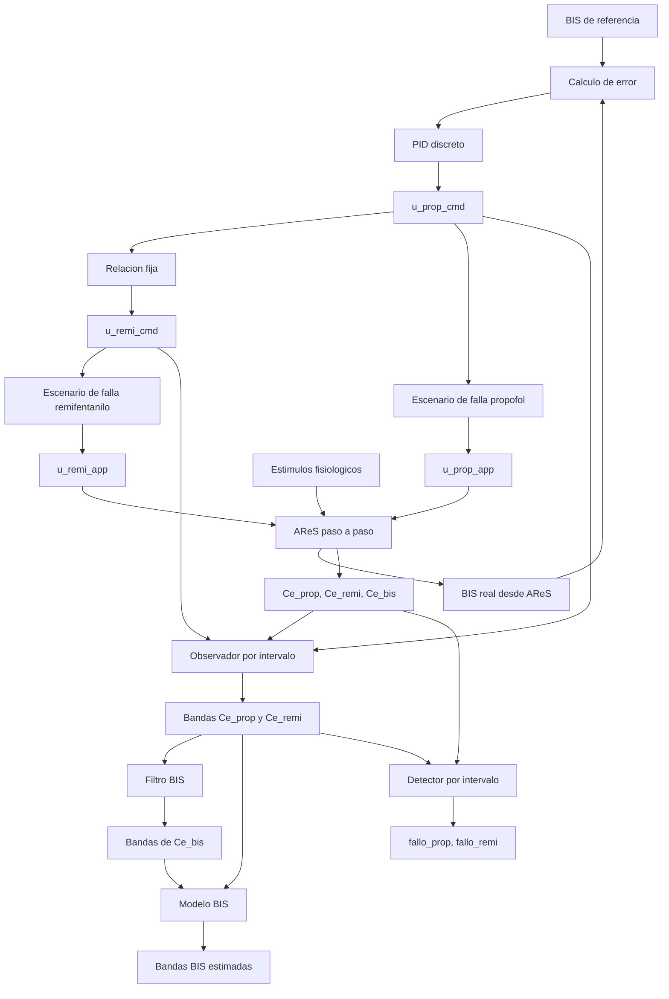
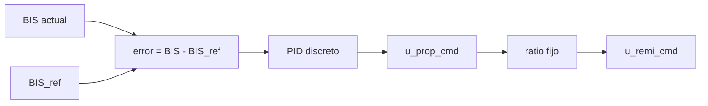
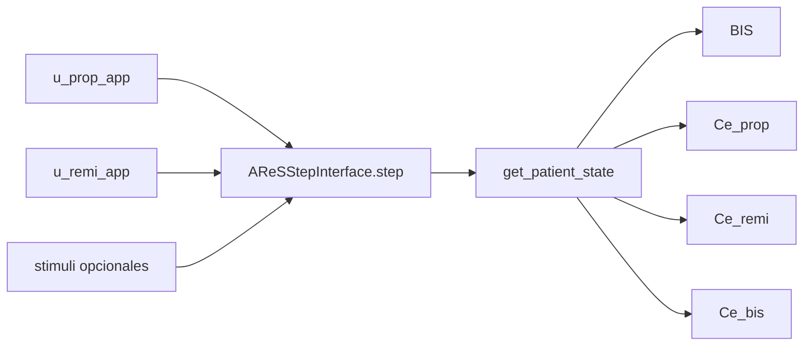
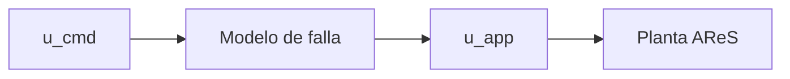
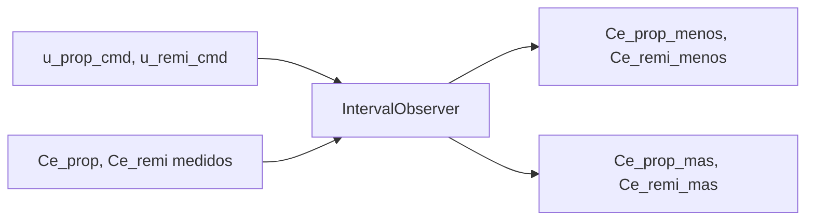
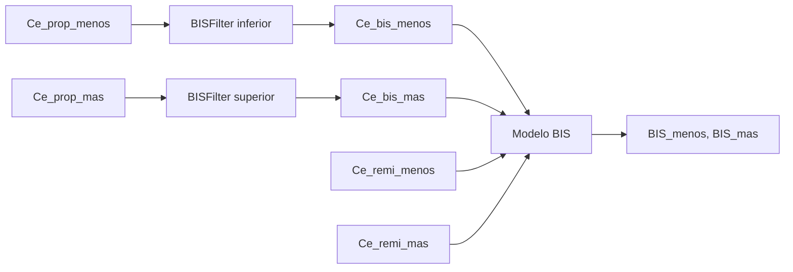
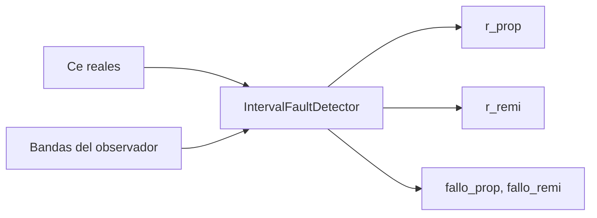

# Control de anestesia con observadores por intervalo

Este repositorio implementa una arquitectura modular para control automatizado de la profundidad anestesica sobre el simulador de paciente `AReS`. El sistema integra control en lazo cerrado con PID, simulacion paso a paso, observadores por intervalo, reconstruccion de BIS y deteccion de fallas de actuacion en los canales de propofol y remifentanilo.

El objetivo de diseno ha sido separar de manera explicita las capas de control, planta, estimacion, reconstruccion de salida y deteccion, de modo que el sistema pueda evolucionar hacia integracion con hardware real, observadores mas sofisticados y logica de supervision adicional sin reescribir la base del proyecto.

La documentacion operativa para reproducir experimentos y reconstruir el entorno de trabajo se encuentra en [docs/runbook.md](</C:/Users/casti/OneDrive - Instituto Politecnico Nacional/OCTAVO SEMESTRE/P.I/PTIII/simulaciones_trabajo_final/Proyecto_control_py_AReS/docs/runbook.md>).

## Arquitectura general

El flujo completo del sistema puede resumirse de la siguiente forma:



## Componentes principales

### 1. Nucleo de control en lazo cerrado

El controlador discreto esta implementado en [src/control_anestesia/controllers/pid.py](</C:/Users/casti/OneDrive - Instituto Politecnico Nacional/OCTAVO SEMESTRE/P.I/PTIII/simulaciones_trabajo_final/Proyecto_control_py_AReS/src/control_anestesia/controllers/pid.py:1>). La ley de control se calcula en [pid.py:15](</C:/Users/casti/OneDrive - Instituto Politecnico Nacional/OCTAVO SEMESTRE/P.I/PTIII/simulaciones_trabajo_final/Proyecto_control_py_AReS/src/control_anestesia/controllers/pid.py:15>), donde se actualizan el termino integral, el termino derivativo y la salida `u`.

En el escenario con observadores, el lazo principal se ejecuta en [src/control_anestesia/scenarios/closed_loop_pid_observer.py](</C:/Users/casti/OneDrive - Instituto Politecnico Nacional/OCTAVO SEMESTRE/P.I/PTIII/simulaciones_trabajo_final/Proyecto_control_py_AReS/src/control_anestesia/scenarios/closed_loop_pid_observer.py:58>). La referencia `BIS_ref` y la relacion fija entre farmacos `ratio` se definen en [closed_loop_pid_observer.py:71](</C:/Users/casti/OneDrive - Instituto Politecnico Nacional/OCTAVO SEMESTRE/P.I/PTIII/simulaciones_trabajo_final/Proyecto_control_py_AReS/src/control_anestesia/scenarios/closed_loop_pid_observer.py:71>) y [closed_loop_pid_observer.py:72](</C:/Users/casti/OneDrive - Instituto Politecnico Nacional/OCTAVO SEMESTRE/P.I/PTIII/simulaciones_trabajo_final/Proyecto_control_py_AReS/src/control_anestesia/scenarios/closed_loop_pid_observer.py:72>).

El error se calcula como

```text
error = BIS_actual - BIS_ref
```

en [closed_loop_pid_observer.py:224](</C:/Users/casti/OneDrive - Instituto Politecnico Nacional/OCTAVO SEMESTRE/P.I/PTIII/simulaciones_trabajo_final/Proyecto_control_py_AReS/src/control_anestesia/scenarios/closed_loop_pid_observer.py:224>). La senal `u_prop_cmd` se obtiene del PID en [closed_loop_pid_observer.py:226](</C:/Users/casti/OneDrive - Instituto Politecnico Nacional/OCTAVO SEMESTRE/P.I/PTIII/simulaciones_trabajo_final/Proyecto_control_py_AReS/src/control_anestesia/scenarios/closed_loop_pid_observer.py:226>) y `u_remi_cmd` se genera mediante la relacion fija en [closed_loop_pid_observer.py:229](</C:/Users/casti/OneDrive - Instituto Politecnico Nacional/OCTAVO SEMESTRE/P.I/PTIII/simulaciones_trabajo_final/Proyecto_control_py_AReS/src/control_anestesia/scenarios/closed_loop_pid_observer.py:229>).



### 2. Planta AReS en tiempo discreto

La encapsulacion paso a paso de la planta se encuentra en [src/control_anestesia/simulator_interface/ares_step_interface.py](</C:/Users/casti/OneDrive - Instituto Politecnico Nacional/OCTAVO SEMESTRE/P.I/PTIII/simulaciones_trabajo_final/Proyecto_control_py_AReS/src/control_anestesia/simulator_interface/ares_step_interface.py:10>). La inicializacion admite estimulos fisiologicos mediante el argumento `stimuli` en [ares_step_interface.py:16](</C:/Users/casti/OneDrive - Instituto Politecnico Nacional/OCTAVO SEMESTRE/P.I/PTIII/simulaciones_trabajo_final/Proyecto_control_py_AReS/src/control_anestesia/simulator_interface/ares_step_interface.py:16>) y se propaga a `AReS` en [ares_step_interface.py:28](</C:/Users/casti/OneDrive - Instituto Politecnico Nacional/OCTAVO SEMESTRE/P.I/PTIII/simulaciones_trabajo_final/Proyecto_control_py_AReS/src/control_anestesia/simulator_interface/ares_step_interface.py:28>).

La evolucion por muestra se realiza con `one_step_simulation` en [ares_step_interface.py:36](</C:/Users/casti/OneDrive - Instituto Politecnico Nacional/OCTAVO SEMESTRE/P.I/PTIII/simulaciones_trabajo_final/Proyecto_control_py_AReS/src/control_anestesia/simulator_interface/ares_step_interface.py:36>) y el estado del paciente se recupera mediante `get_patient_state()` en [ares_step_interface.py:43](</C:/Users/casti/OneDrive - Instituto Politecnico Nacional/OCTAVO SEMESTRE/P.I/PTIII/simulaciones_trabajo_final/Proyecto_control_py_AReS/src/control_anestesia/simulator_interface/ares_step_interface.py:43>).

En el lazo con observador, la planta recibe `u_prop_app` y `u_remi_app` en [closed_loop_pid_observer.py:172](</C:/Users/casti/OneDrive - Instituto Politecnico Nacional/OCTAVO SEMESTRE/P.I/PTIII/simulaciones_trabajo_final/Proyecto_control_py_AReS/src/control_anestesia/scenarios/closed_loop_pid_observer.py:172>). De ese estado se extraen:

- `BIS` en [closed_loop_pid_observer.py:174](</C:/Users/casti/OneDrive - Instituto Politecnico Nacional/OCTAVO SEMESTRE/P.I/PTIII/simulaciones_trabajo_final/Proyecto_control_py_AReS/src/control_anestesia/scenarios/closed_loop_pid_observer.py:174>)
- `Ce_prop` en [closed_loop_pid_observer.py:175](</C:/Users/casti/OneDrive - Instituto Politecnico Nacional/OCTAVO SEMESTRE/P.I/PTIII/simulaciones_trabajo_final/Proyecto_control_py_AReS/src/control_anestesia/scenarios/closed_loop_pid_observer.py:175>)
- `Ce_remi` en [closed_loop_pid_observer.py:176](</C:/Users/casti/OneDrive - Instituto Politecnico Nacional/OCTAVO SEMESTRE/P.I/PTIII/simulaciones_trabajo_final/Proyecto_control_py_AReS/src/control_anestesia/scenarios/closed_loop_pid_observer.py:176>)
- `Ce_bis` en [closed_loop_pid_observer.py:177](</C:/Users/casti/OneDrive - Instituto Politecnico Nacional/OCTAVO SEMESTRE/P.I/PTIII/simulaciones_trabajo_final/Proyecto_control_py_AReS/src/control_anestesia/scenarios/closed_loop_pid_observer.py:177>)



### 3. Separacion entre senal comandada y senal aplicada

La separacion entre `u_cmd` y `u_app` es el mecanismo que permite representar fallas de actuacion. Las funciones de inyeccion de falla se definen en [src/control_anestesia/fault_detection/fault_scenarios.py](</C:/Users/casti/OneDrive - Instituto Politecnico Nacional/OCTAVO SEMESTRE/P.I/PTIII/simulaciones_trabajo_final/Proyecto_control_py_AReS/src/control_anestesia/fault_detection/fault_scenarios.py:1>), donde:

- `apply_prop_fault(...)` escala `u_prop_cmd` en [fault_scenarios.py:1](</C:/Users/casti/OneDrive - Instituto Politecnico Nacional/OCTAVO SEMESTRE/P.I/PTIII/simulaciones_trabajo_final/Proyecto_control_py_AReS/src/control_anestesia/fault_detection/fault_scenarios.py:1>)
- `apply_remi_fault(...)` escala `u_remi_cmd` en [fault_scenarios.py:7](</C:/Users/casti/OneDrive - Instituto Politecnico Nacional/OCTAVO SEMESTRE/P.I/PTIII/simulaciones_trabajo_final/Proyecto_control_py_AReS/src/control_anestesia/fault_detection/fault_scenarios.py:7>)

En el lazo principal, la senal comandada se transforma en senal aplicada en [closed_loop_pid_observer.py:156](</C:/Users/casti/OneDrive - Instituto Politecnico Nacional/OCTAVO SEMESTRE/P.I/PTIII/simulaciones_trabajo_final/Proyecto_control_py_AReS/src/control_anestesia/scenarios/closed_loop_pid_observer.py:156>) y [closed_loop_pid_observer.py:164](</C:/Users/casti/OneDrive - Instituto Politecnico Nacional/OCTAVO SEMESTRE/P.I/PTIII/simulaciones_trabajo_final/Proyecto_control_py_AReS/src/control_anestesia/scenarios/closed_loop_pid_observer.py:164>). Las senales resultantes se almacenan en el `DataFrame` en [closed_loop_pid_observer.py:267](</C:/Users/casti/OneDrive - Instituto Politecnico Nacional/OCTAVO SEMESTRE/P.I/PTIII/simulaciones_trabajo_final/Proyecto_control_py_AReS/src/control_anestesia/scenarios/closed_loop_pid_observer.py:267>) a [closed_loop_pid_observer.py:270](</C:/Users/casti/OneDrive - Instituto Politecnico Nacional/OCTAVO SEMESTRE/P.I/PTIII/simulaciones_trabajo_final/Proyecto_control_py_AReS/src/control_anestesia/scenarios/closed_loop_pid_observer.py:270>).

Conceptualmente:

```text
u_cmd = lo calculado por el controlador
u_app = lo realmente aplicado a la planta
```

Por tanto, una falla de bomba queda modelada como:

```text
u_app != u_cmd
```



### 4. Modelo y observadores por intervalo

El modelo dinamico discreto utilizado por el observador se construye en [src/control_anestesia/observers/observer_model.py](</C:/Users/casti/OneDrive - Instituto Politecnico Nacional/OCTAVO SEMESTRE/P.I/PTIII/simulaciones_trabajo_final/Proyecto_control_py_AReS/src/control_anestesia/observers/observer_model.py:5>). La estructura contiene ocho estados: cuatro asociados a propofol y cuatro a remifentanilo. La matriz de salida `C` selecciona las concentraciones de sitio de efecto `Ce_prop` y `Ce_remi` en [observer_model.py:70](</C:/Users/casti/OneDrive - Instituto Politecnico Nacional/OCTAVO SEMESTRE/P.I/PTIII/simulaciones_trabajo_final/Proyecto_control_py_AReS/src/control_anestesia/observers/observer_model.py:70>).

El observador por intervalo esta implementado en [src/control_anestesia/observers/interval_observer.py](</C:/Users/casti/OneDrive - Instituto Politecnico Nacional/OCTAVO SEMESTRE/P.I/PTIII/simulaciones_trabajo_final/Proyecto_control_py_AReS/src/control_anestesia/observers/interval_observer.py:4>). La actualizacion de las cotas superior e inferior se realiza en [interval_observer.py:33](</C:/Users/casti/OneDrive - Instituto Politecnico Nacional/OCTAVO SEMESTRE/P.I/PTIII/simulaciones_trabajo_final/Proyecto_control_py_AReS/src/control_anestesia/observers/interval_observer.py:33>) y [interval_observer.py:40](</C:/Users/casti/OneDrive - Instituto Politecnico Nacional/OCTAVO SEMESTRE/P.I/PTIII/simulaciones_trabajo_final/Proyecto_control_py_AReS/src/control_anestesia/observers/interval_observer.py:40>). La correccion por innovacion se define con la convencion `y_estimada - y` en [interval_observer.py:26](</C:/Users/casti/OneDrive - Instituto Politecnico Nacional/OCTAVO SEMESTRE/P.I/PTIII/simulaciones_trabajo_final/Proyecto_control_py_AReS/src/control_anestesia/observers/interval_observer.py:26>).

En el escenario principal:

- el modelo se discretiza en [closed_loop_pid_observer.py:105](</C:/Users/casti/OneDrive - Instituto Politecnico Nacional/OCTAVO SEMESTRE/P.I/PTIII/simulaciones_trabajo_final/Proyecto_control_py_AReS/src/control_anestesia/scenarios/closed_loop_pid_observer.py:105>)
- el observador se instancia en [closed_loop_pid_observer.py:128](</C:/Users/casti/OneDrive - Instituto Politecnico Nacional/OCTAVO SEMESTRE/P.I/PTIII/simulaciones_trabajo_final/Proyecto_control_py_AReS/src/control_anestesia/scenarios/closed_loop_pid_observer.py:128>)
- la medicion usada para correccion se forma como `y_medida = [Ce_prop, Ce_remi]` en [closed_loop_pid_observer.py:179](</C:/Users/casti/OneDrive - Instituto Politecnico Nacional/OCTAVO SEMESTRE/P.I/PTIII/simulaciones_trabajo_final/Proyecto_control_py_AReS/src/control_anestesia/scenarios/closed_loop_pid_observer.py:179>)
- la entrada del observador se construye con la senal comandada `u_observer = [u_prop_cmd, u_remi_cmd]` en [closed_loop_pid_observer.py:183](</C:/Users/casti/OneDrive - Instituto Politecnico Nacional/OCTAVO SEMESTRE/P.I/PTIII/simulaciones_trabajo_final/Proyecto_control_py_AReS/src/control_anestesia/scenarios/closed_loop_pid_observer.py:183>)
- el paso del observador se ejecuta en [closed_loop_pid_observer.py:189](</C:/Users/casti/OneDrive - Instituto Politecnico Nacional/OCTAVO SEMESTRE/P.I/PTIII/simulaciones_trabajo_final/Proyecto_control_py_AReS/src/control_anestesia/scenarios/closed_loop_pid_observer.py:189>)
- las cotas `Ce_prop_menos`, `Ce_prop_mas`, `Ce_remi_menos` y `Ce_remi_mas` se desacoplan en [closed_loop_pid_observer.py:195](</C:/Users/casti/OneDrive - Instituto Politecnico Nacional/OCTAVO SEMESTRE/P.I/PTIII/simulaciones_trabajo_final/Proyecto_control_py_AReS/src/control_anestesia/scenarios/closed_loop_pid_observer.py:195>) a [closed_loop_pid_observer.py:198](</C:/Users/casti/OneDrive - Instituto Politecnico Nacional/OCTAVO SEMESTRE/P.I/PTIII/simulaciones_trabajo_final/Proyecto_control_py_AReS/src/control_anestesia/scenarios/closed_loop_pid_observer.py:198>)

El observador emplea la senal comandada y no la senal aplicada. Esta decision, explicitada en [closed_loop_pid_observer.py:181](</C:/Users/casti/OneDrive - Instituto Politecnico Nacional/OCTAVO SEMESTRE/P.I/PTIII/simulaciones_trabajo_final/Proyecto_control_py_AReS/src/control_anestesia/scenarios/closed_loop_pid_observer.py:181>), es esencial para que una discrepancia entre planta y modelo se manifieste como residuo diagnostico.



### 5. Filtro BIS y reconstruccion de BIS

La dinamica del monitor BIS se replica en [src/control_anestesia/models/bis_filter.py](</C:/Users/casti/OneDrive - Instituto Politecnico Nacional/OCTAVO SEMESTRE/P.I/PTIII/simulaciones_trabajo_final/Proyecto_control_py_AReS/src/control_anestesia/models/bis_filter.py:7>). El filtro LTI y el retardo interno del sensor se obtienen de `AReS` en [bis_filter.py:9](</C:/Users/casti/OneDrive - Instituto Politecnico Nacional/OCTAVO SEMESTRE/P.I/PTIII/simulaciones_trabajo_final/Proyecto_control_py_AReS/src/control_anestesia/models/bis_filter.py:9>), y la evolucion por muestra se calcula en [bis_filter.py:17](</C:/Users/casti/OneDrive - Instituto Politecnico Nacional/OCTAVO SEMESTRE/P.I/PTIII/simulaciones_trabajo_final/Proyecto_control_py_AReS/src/control_anestesia/models/bis_filter.py:17>).

El modelo no lineal de BIS se implementa en [src/control_anestesia/models/bis_model.py](</C:/Users/casti/OneDrive - Instituto Politecnico Nacional/OCTAVO SEMESTRE/P.I/PTIII/simulaciones_trabajo_final/Proyecto_control_py_AReS/src/control_anestesia/models/bis_model.py:4>). Esta funcion mapea `(Ce_prop, Ce_remi)` a `BIS` usando una parametrizacion tipo Eleveld.

En el escenario principal:

- `Ce_bis_menos` y `Ce_bis_mas` se reconstruyen a partir de las cotas de propofol en [closed_loop_pid_observer.py:200](</C:/Users/casti/OneDrive - Instituto Politecnico Nacional/OCTAVO SEMESTRE/P.I/PTIII/simulaciones_trabajo_final/Proyecto_control_py_AReS/src/control_anestesia/scenarios/closed_loop_pid_observer.py:200>) y [closed_loop_pid_observer.py:201](</C:/Users/casti/OneDrive - Instituto Politecnico Nacional/OCTAVO SEMESTRE/P.I/PTIII/simulaciones_trabajo_final/Proyecto_control_py_AReS/src/control_anestesia/scenarios/closed_loop_pid_observer.py:201>)
- `BIS_desde_Ce_real` se obtiene en [closed_loop_pid_observer.py:203](</C:/Users/casti/OneDrive - Instituto Politecnico Nacional/OCTAVO SEMESTRE/P.I/PTIII/simulaciones_trabajo_final/Proyecto_control_py_AReS/src/control_anestesia/scenarios/closed_loop_pid_observer.py:203>)
- `BIS_desde_Ce_bis` se obtiene en [closed_loop_pid_observer.py:204](</C:/Users/casti/OneDrive - Instituto Politecnico Nacional/OCTAVO SEMESTRE/P.I/PTIII/simulaciones_trabajo_final/Proyecto_control_py_AReS/src/control_anestesia/scenarios/closed_loop_pid_observer.py:204>)
- la banda `BIS_menos`, `BIS_mas` se calcula en [closed_loop_pid_observer.py:206](</C:/Users/casti/OneDrive - Instituto Politecnico Nacional/OCTAVO SEMESTRE/P.I/PTIII/simulaciones_trabajo_final/Proyecto_control_py_AReS/src/control_anestesia/scenarios/closed_loop_pid_observer.py:206>)



### 6. Deteccion de fallas

La logica del detector por intervalo esta implementada en [src/control_anestesia/fault_detection/detector_interval.py](</C:/Users/casti/OneDrive - Instituto Politecnico Nacional/OCTAVO SEMESTRE/P.I/PTIII/simulaciones_trabajo_final/Proyecto_control_py_AReS/src/control_anestesia/fault_detection/detector_interval.py:4>). Los residuos se construyen en [detector_interval.py:12](</C:/Users/casti/OneDrive - Instituto Politecnico Nacional/OCTAVO SEMESTRE/P.I/PTIII/simulaciones_trabajo_final/Proyecto_control_py_AReS/src/control_anestesia/fault_detection/detector_interval.py:12>) a [detector_interval.py:20](</C:/Users/casti/OneDrive - Instituto Politecnico Nacional/OCTAVO SEMESTRE/P.I/PTIII/simulaciones_trabajo_final/Proyecto_control_py_AReS/src/control_anestesia/fault_detection/detector_interval.py:20>) segun:

```text
r = [y_mas - y; -(y - y_menos)]
```

La ventana de activacion temporal se aplica en [detector_interval.py:22](</C:/Users/casti/OneDrive - Instituto Politecnico Nacional/OCTAVO SEMESTRE/P.I/PTIII/simulaciones_trabajo_final/Proyecto_control_py_AReS/src/control_anestesia/fault_detection/detector_interval.py:22>) y la regla de decision se evalua en [detector_interval.py:25](</C:/Users/casti/OneDrive - Instituto Politecnico Nacional/OCTAVO SEMESTRE/P.I/PTIII/simulaciones_trabajo_final/Proyecto_control_py_AReS/src/control_anestesia/fault_detection/detector_interval.py:25>) y [detector_interval.py:26](</C:/Users/casti/OneDrive - Instituto Politecnico Nacional/OCTAVO SEMESTRE/P.I/PTIII/simulaciones_trabajo_final/Proyecto_control_py_AReS/src/control_anestesia/fault_detection/detector_interval.py:26>):

```text
fallo si r_sup < -epsilon o r_inf > epsilon
```

En el lazo principal, la evaluacion del detector se realiza en [closed_loop_pid_observer.py:214](</C:/Users/casti/OneDrive - Instituto Politecnico Nacional/OCTAVO SEMESTRE/P.I/PTIII/simulaciones_trabajo_final/Proyecto_control_py_AReS/src/control_anestesia/scenarios/closed_loop_pid_observer.py:214>) y sus resultados se almacenan en [closed_loop_pid_observer.py:259](</C:/Users/casti/OneDrive - Instituto Politecnico Nacional/OCTAVO SEMESTRE/P.I/PTIII/simulaciones_trabajo_final/Proyecto_control_py_AReS/src/control_anestesia/scenarios/closed_loop_pid_observer.py:259>) a [closed_loop_pid_observer.py:265](</C:/Users/casti/OneDrive - Instituto Politecnico Nacional/OCTAVO SEMESTRE/P.I/PTIII/simulaciones_trabajo_final/Proyecto_control_py_AReS/src/control_anestesia/scenarios/closed_loop_pid_observer.py:265>).



### 7. Estimulos fisiologicos

La infraestructura para incorporar perturbaciones fisiologicas ya esta preparada en la interfaz de simulacion mediante `stimuli` en [ares_step_interface.py:16](</C:/Users/casti/OneDrive - Instituto Politecnico Nacional/OCTAVO SEMESTRE/P.I/PTIII/simulaciones_trabajo_final/Proyecto_control_py_AReS/src/control_anestesia/simulator_interface/ares_step_interface.py:16>). Un ejemplo de definicion de estimulos se encuentra en [scripts/run_pid_observer.py:7](</C:/Users/casti/OneDrive - Instituto Politecnico Nacional/OCTAVO SEMESTRE/P.I/PTIII/simulaciones_trabajo_final/Proyecto_control_py_AReS/scripts/run_pid_observer.py:7>), con eventos como intubation, incision, skin manipulation y suture.

El proposito metodologico de estos estimulos es verificar que el detector no interprete una perturbacion fisiologica modelada por `AReS` como una falla de actuacion.

## Trazabilidad de senales

La siguiente tabla resume el origen computacional, la desacoplacion y el almacenamiento de las senales principales.

| Senal | Adquisicion o generacion | Desacople o procesamiento | Almacenamiento |
| --- | --- | --- | --- |
| `BIS` | [ares_step_interface.py:43](</C:/Users/casti/OneDrive - Instituto Politecnico Nacional/OCTAVO SEMESTRE/P.I/PTIII/simulaciones_trabajo_final/Proyecto_control_py_AReS/src/control_anestesia/simulator_interface/ares_step_interface.py:43>) | [closed_loop_pid_observer.py:174](</C:/Users/casti/OneDrive - Instituto Politecnico Nacional/OCTAVO SEMESTRE/P.I/PTIII/simulaciones_trabajo_final/Proyecto_control_py_AReS/src/control_anestesia/scenarios/closed_loop_pid_observer.py:174>) y uso en [closed_loop_pid_observer.py:224](</C:/Users/casti/OneDrive - Instituto Politecnico Nacional/OCTAVO SEMESTRE/P.I/PTIII/simulaciones_trabajo_final/Proyecto_control_py_AReS/src/control_anestesia/scenarios/closed_loop_pid_observer.py:224>) | [closed_loop_pid_observer.py:238](</C:/Users/casti/OneDrive - Instituto Politecnico Nacional/OCTAVO SEMESTRE/P.I/PTIII/simulaciones_trabajo_final/Proyecto_control_py_AReS/src/control_anestesia/scenarios/closed_loop_pid_observer.py:238>) |
| `Ce_prop` | [ares_step_interface.py:43](</C:/Users/casti/OneDrive - Instituto Politecnico Nacional/OCTAVO SEMESTRE/P.I/PTIII/simulaciones_trabajo_final/Proyecto_control_py_AReS/src/control_anestesia/simulator_interface/ares_step_interface.py:43>) | extraccion en [closed_loop_pid_observer.py:175](</C:/Users/casti/OneDrive - Instituto Politecnico Nacional/OCTAVO SEMESTRE/P.I/PTIII/simulaciones_trabajo_final/Proyecto_control_py_AReS/src/control_anestesia/scenarios/closed_loop_pid_observer.py:175>), medicion del observador en [closed_loop_pid_observer.py:179](</C:/Users/casti/OneDrive - Instituto Politecnico Nacional/OCTAVO SEMESTRE/P.I/PTIII/simulaciones_trabajo_final/Proyecto_control_py_AReS/src/control_anestesia/scenarios/closed_loop_pid_observer.py:179>) | [closed_loop_pid_observer.py:247](</C:/Users/casti/OneDrive - Instituto Politecnico Nacional/OCTAVO SEMESTRE/P.I/PTIII/simulaciones_trabajo_final/Proyecto_control_py_AReS/src/control_anestesia/scenarios/closed_loop_pid_observer.py:247>) |
| `Ce_remi` | [ares_step_interface.py:43](</C:/Users/casti/OneDrive - Instituto Politecnico Nacional/OCTAVO SEMESTRE/P.I/PTIII/simulaciones_trabajo_final/Proyecto_control_py_AReS/src/control_anestesia/simulator_interface/ares_step_interface.py:43>) | extraccion en [closed_loop_pid_observer.py:176](</C:/Users/casti/OneDrive - Instituto Politecnico Nacional/OCTAVO SEMESTRE/P.I/PTIII/simulaciones_trabajo_final/Proyecto_control_py_AReS/src/control_anestesia/scenarios/closed_loop_pid_observer.py:176>), medicion del observador en [closed_loop_pid_observer.py:179](</C:/Users/casti/OneDrive - Instituto Politecnico Nacional/OCTAVO SEMESTRE/P.I/PTIII/simulaciones_trabajo_final/Proyecto_control_py_AReS/src/control_anestesia/scenarios/closed_loop_pid_observer.py:179>) | [closed_loop_pid_observer.py:248](</C:/Users/casti/OneDrive - Instituto Politecnico Nacional/OCTAVO SEMESTRE/P.I/PTIII/simulaciones_trabajo_final/Proyecto_control_py_AReS/src/control_anestesia/scenarios/closed_loop_pid_observer.py:248>) |
| `Ce_bis` | [ares_step_interface.py:43](</C:/Users/casti/OneDrive - Instituto Politecnico Nacional/OCTAVO SEMESTRE/P.I/PTIII/simulaciones_trabajo_final/Proyecto_control_py_AReS/src/control_anestesia/simulator_interface/ares_step_interface.py:43>) | extraccion en [closed_loop_pid_observer.py:177](</C:/Users/casti/OneDrive - Instituto Politecnico Nacional/OCTAVO SEMESTRE/P.I/PTIII/simulaciones_trabajo_final/Proyecto_control_py_AReS/src/control_anestesia/scenarios/closed_loop_pid_observer.py:177>) y uso en [closed_loop_pid_observer.py:204](</C:/Users/casti/OneDrive - Instituto Politecnico Nacional/OCTAVO SEMESTRE/P.I/PTIII/simulaciones_trabajo_final/Proyecto_control_py_AReS/src/control_anestesia/scenarios/closed_loop_pid_observer.py:204>) | [closed_loop_pid_observer.py:249](</C:/Users/casti/OneDrive - Instituto Politecnico Nacional/OCTAVO SEMESTRE/P.I/PTIII/simulaciones_trabajo_final/Proyecto_control_py_AReS/src/control_anestesia/scenarios/closed_loop_pid_observer.py:249>) |
| `u_prop_cmd` | PID en [closed_loop_pid_observer.py:226](</C:/Users/casti/OneDrive - Instituto Politecnico Nacional/OCTAVO SEMESTRE/P.I/PTIII/simulaciones_trabajo_final/Proyecto_control_py_AReS/src/control_anestesia/scenarios/closed_loop_pid_observer.py:226>) | usado por el observador en [closed_loop_pid_observer.py:183](</C:/Users/casti/OneDrive - Instituto Politecnico Nacional/OCTAVO SEMESTRE/P.I/PTIII/simulaciones_trabajo_final/Proyecto_control_py_AReS/src/control_anestesia/scenarios/closed_loop_pid_observer.py:183>) y por el modelo de falla en [closed_loop_pid_observer.py:156](</C:/Users/casti/OneDrive - Instituto Politecnico Nacional/OCTAVO SEMESTRE/P.I/PTIII/simulaciones_trabajo_final/Proyecto_control_py_AReS/src/control_anestesia/scenarios/closed_loop_pid_observer.py:156>) | [closed_loop_pid_observer.py:269](</C:/Users/casti/OneDrive - Instituto Politecnico Nacional/OCTAVO SEMESTRE/P.I/PTIII/simulaciones_trabajo_final/Proyecto_control_py_AReS/src/control_anestesia/scenarios/closed_loop_pid_observer.py:269>) |
| `u_remi_cmd` | ratio en [closed_loop_pid_observer.py:229](</C:/Users/casti/OneDrive - Instituto Politecnico Nacional/OCTAVO SEMESTRE/P.I/PTIII/simulaciones_trabajo_final/Proyecto_control_py_AReS/src/control_anestesia/scenarios/closed_loop_pid_observer.py:229>) | usado por el observador en [closed_loop_pid_observer.py:183](</C:/Users/casti/OneDrive - Instituto Politecnico Nacional/OCTAVO SEMESTRE/P.I/PTIII/simulaciones_trabajo_final/Proyecto_control_py_AReS/src/control_anestesia/scenarios/closed_loop_pid_observer.py:183>) y por el modelo de falla en [closed_loop_pid_observer.py:164](</C:/Users/casti/OneDrive - Instituto Politecnico Nacional/OCTAVO SEMESTRE/P.I/PTIII/simulaciones_trabajo_final/Proyecto_control_py_AReS/src/control_anestesia/scenarios/closed_loop_pid_observer.py:164>) | [closed_loop_pid_observer.py:270](</C:/Users/casti/OneDrive - Instituto Politecnico Nacional/OCTAVO SEMESTRE/P.I/PTIII/simulaciones_trabajo_final/Proyecto_control_py_AReS/src/control_anestesia/scenarios/closed_loop_pid_observer.py:270>) |
| `u_prop_app` | falla aplicada en [closed_loop_pid_observer.py:156](</C:/Users/casti/OneDrive - Instituto Politecnico Nacional/OCTAVO SEMESTRE/P.I/PTIII/simulaciones_trabajo_final/Proyecto_control_py_AReS/src/control_anestesia/scenarios/closed_loop_pid_observer.py:156>) | entrada real a planta en [closed_loop_pid_observer.py:172](</C:/Users/casti/OneDrive - Instituto Politecnico Nacional/OCTAVO SEMESTRE/P.I/PTIII/simulaciones_trabajo_final/Proyecto_control_py_AReS/src/control_anestesia/scenarios/closed_loop_pid_observer.py:172>) | [closed_loop_pid_observer.py:267](</C:/Users/casti/OneDrive - Instituto Politecnico Nacional/OCTAVO SEMESTRE/P.I/PTIII/simulaciones_trabajo_final/Proyecto_control_py_AReS/src/control_anestesia/scenarios/closed_loop_pid_observer.py:267>) |
| `u_remi_app` | falla aplicada en [closed_loop_pid_observer.py:164](</C:/Users/casti/OneDrive - Instituto Politecnico Nacional/OCTAVO SEMESTRE/P.I/PTIII/simulaciones_trabajo_final/Proyecto_control_py_AReS/src/control_anestesia/scenarios/closed_loop_pid_observer.py:164>) | entrada real a planta en [closed_loop_pid_observer.py:172](</C:/Users/casti/OneDrive - Instituto Politecnico Nacional/OCTAVO SEMESTRE/P.I/PTIII/simulaciones_trabajo_final/Proyecto_control_py_AReS/src/control_anestesia/scenarios/closed_loop_pid_observer.py:172>) | [closed_loop_pid_observer.py:268](</C:/Users/casti/OneDrive - Instituto Politecnico Nacional/OCTAVO SEMESTRE/P.I/PTIII/simulaciones_trabajo_final/Proyecto_control_py_AReS/src/control_anestesia/scenarios/closed_loop_pid_observer.py:268>) |
| `Ce_prop_mas`, `Ce_prop_menos` | observador en [closed_loop_pid_observer.py:189](</C:/Users/casti/OneDrive - Instituto Politecnico Nacional/OCTAVO SEMESTRE/P.I/PTIII/simulaciones_trabajo_final/Proyecto_control_py_AReS/src/control_anestesia/scenarios/closed_loop_pid_observer.py:189>) | desacople en [closed_loop_pid_observer.py:195](</C:/Users/casti/OneDrive - Instituto Politecnico Nacional/OCTAVO SEMESTRE/P.I/PTIII/simulaciones_trabajo_final/Proyecto_control_py_AReS/src/control_anestesia/scenarios/closed_loop_pid_observer.py:195>) y [closed_loop_pid_observer.py:197](</C:/Users/casti/OneDrive - Instituto Politecnico Nacional/OCTAVO SEMESTRE/P.I/PTIII/simulaciones_trabajo_final/Proyecto_control_py_AReS/src/control_anestesia/scenarios/closed_loop_pid_observer.py:197>) | [closed_loop_pid_observer.py:254](</C:/Users/casti/OneDrive - Instituto Politecnico Nacional/OCTAVO SEMESTRE/P.I/PTIII/simulaciones_trabajo_final/Proyecto_control_py_AReS/src/control_anestesia/scenarios/closed_loop_pid_observer.py:254>) y [closed_loop_pid_observer.py:255](</C:/Users/casti/OneDrive - Instituto Politecnico Nacional/OCTAVO SEMESTRE/P.I/PTIII/simulaciones_trabajo_final/Proyecto_control_py_AReS/src/control_anestesia/scenarios/closed_loop_pid_observer.py:255>) |
| `Ce_remi_mas`, `Ce_remi_menos` | observador en [closed_loop_pid_observer.py:189](</C:/Users/casti/OneDrive - Instituto Politecnico Nacional/OCTAVO SEMESTRE/P.I/PTIII/simulaciones_trabajo_final/Proyecto_control_py_AReS/src/control_anestesia/scenarios/closed_loop_pid_observer.py:189>) | desacople en [closed_loop_pid_observer.py:196](</C:/Users/casti/OneDrive - Instituto Politecnico Nacional/OCTAVO SEMESTRE/P.I/PTIII/simulaciones_trabajo_final/Proyecto_control_py_AReS/src/control_anestesia/scenarios/closed_loop_pid_observer.py:196>) y [closed_loop_pid_observer.py:198](</C:/Users/casti/OneDrive - Instituto Politecnico Nacional/OCTAVO SEMESTRE/P.I/PTIII/simulaciones_trabajo_final/Proyecto_control_py_AReS/src/control_anestesia/scenarios/closed_loop_pid_observer.py:198>) | [closed_loop_pid_observer.py:256](</C:/Users/casti/OneDrive - Instituto Politecnico Nacional/OCTAVO SEMESTRE/P.I/PTIII/simulaciones_trabajo_final/Proyecto_control_py_AReS/src/control_anestesia/scenarios/closed_loop_pid_observer.py:256>) y [closed_loop_pid_observer.py:257](</C:/Users/casti/OneDrive - Instituto Politecnico Nacional/OCTAVO SEMESTRE/P.I/PTIII/simulaciones_trabajo_final/Proyecto_control_py_AReS/src/control_anestesia/scenarios/closed_loop_pid_observer.py:257>) |
| `Ce_bis_mas`, `Ce_bis_menos` | filtro BIS en [closed_loop_pid_observer.py:200](</C:/Users/casti/OneDrive - Instituto Politecnico Nacional/OCTAVO SEMESTRE/P.I/PTIII/simulaciones_trabajo_final/Proyecto_control_py_AReS/src/control_anestesia/scenarios/closed_loop_pid_observer.py:200>) y [closed_loop_pid_observer.py:201](</C:/Users/casti/OneDrive - Instituto Politecnico Nacional/OCTAVO SEMESTRE/P.I/PTIII/simulaciones_trabajo_final/Proyecto_control_py_AReS/src/control_anestesia/scenarios/closed_loop_pid_observer.py:201>) | usado por la reconstruccion de bandas BIS en [closed_loop_pid_observer.py:206](</C:/Users/casti/OneDrive - Instituto Politecnico Nacional/OCTAVO SEMESTRE/P.I/PTIII/simulaciones_trabajo_final/Proyecto_control_py_AReS/src/control_anestesia/scenarios/closed_loop_pid_observer.py:206>) | [closed_loop_pid_observer.py:251](</C:/Users/casti/OneDrive - Instituto Politecnico Nacional/OCTAVO SEMESTRE/P.I/PTIII/simulaciones_trabajo_final/Proyecto_control_py_AReS/src/control_anestesia/scenarios/closed_loop_pid_observer.py:251>) y [closed_loop_pid_observer.py:252](</C:/Users/casti/OneDrive - Instituto Politecnico Nacional/OCTAVO SEMESTRE/P.I/PTIII/simulaciones_trabajo_final/Proyecto_control_py_AReS/src/control_anestesia/scenarios/closed_loop_pid_observer.py:252>) |

## Scripts principales

Los experimentos principales pueden ejecutarse mediante:

```bash
python scripts/run_baseline.py
python scripts/run_pid_ratio.py
python scripts/run_pid_observer.py
```

El script [scripts/run_pid_observer.py](</C:/Users/casti/OneDrive - Instituto Politecnico Nacional/OCTAVO SEMESTRE/P.I/PTIII/simulaciones_trabajo_final/Proyecto_control_py_AReS/scripts/run_pid_observer.py:14>) permite ensayar el sistema completo con observadores, bandas de BIS, deteccion de fallas y, opcionalmente, estimulos fisiologicos.

## Entorno de trabajo

La configuracion del entorno se define en [environment.yml](</C:/Users/casti/OneDrive - Instituto Politecnico Nacional/OCTAVO SEMESTRE/P.I/PTIII/simulaciones_trabajo_final/Proyecto_control_py_AReS/environment.yml>). El proyecto depende del repositorio externo `AReS`, instalado en modo editable desde la ruta relativa `../AReS-Anesthesia-Response-Simulator/python`.

La secuencia de instalacion recomendada es:

```bash
conda env create -f environment.yml
conda activate control_anestesia_env
pip install -e .
```

Si la instalacion editable de `AReS` no se resuelve automaticamente desde `environment.yml`, debe ejecutarse adicionalmente:

```bash
pip install -e ../AReS-Anesthesia-Response-Simulator/python
```

## Resultado tecnico alcanzado

En su estado actual, el repositorio ya permite:

- controlar `BIS` mediante un lazo cerrado discreto con PID
- simular la planta farmacologica y farmacodinamica con `AReS`
- separar explicitamente senales comandadas y senales aplicadas
- estimar estados internos por medio de observadores por intervalo
- reconstruir bandas de `BIS` a partir de estados estimados
- detectar fallas de actuacion en propofol y remifentanilo
- analizar la robustez del detector frente a estimulos fisiologicos modelados
- mantener una base modular para integracion futura con hardware y logica de supervision adicional
